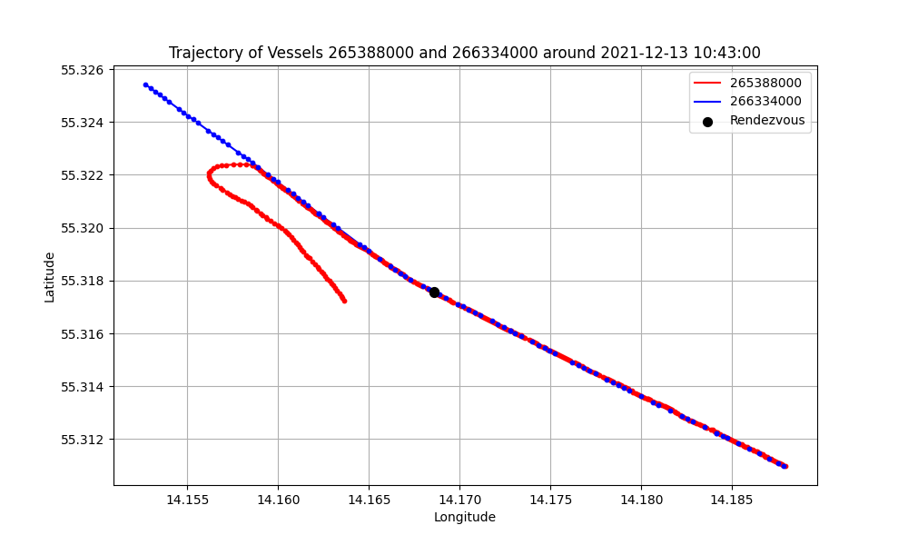

# Individual Assignment Report

## Methodology

First step was to filter out any unneeded data, noise and outliers to make the analysis more precise and efficient:

* Unneeded columns were dropped from the dataframe.
* Entries with improper coordinate values where filtered out to eliminate outliers.
* Entries with a very low or non-existing speed over ground where filtered out.
  This helped to eliminate vessels that were not moving because they were docked in ports.
* Entries that were not located in the given circle were filtered out based on Haversine distance to the circle center.

A sliding window technique was employed to group entries based on 30-second time intervals
and analyze the closest pairs within each window.
After analyzing the 30-second window, it is shifted forward by 5 seconds, and the analysis is repeated.

This grouping method is crucial because the time difference between consecutive GPS positions varies for most ships.
Therefore, we can't determine the exact distance between two ships at a specific moment but can estimate it
within a 30-second window. Previous analyses have shown that the most common time delta between
corresponding vessel GPS positions is approximately 30 seconds, so that's why this specific value was chosen.

To perform a search within the given time window the BallTree algorithm is used,
utilizing the Haversine distance metric. The BallTree is queried to find the distance and index of the closest neighbor
for each vessel.

## Results

Rendezvous of the closest pair of vessels:

```
MMSI 1: 265388000 | Location [55.317565 14.168575]
MMSI 2: 266334000 | Location [55.317563 14.168578]
Distance: 0.292 meters
Timestamp: 2021-12-13 10:43:00
```

* Blue and red lines indicate the trajectory of the vessels
* Blue and red markers indicate the concrete positions at given timestamps.
* Black markers indicate the approximate rendezvous point (closest position between 2 vessels)

<p style="text-align: center;">
  
</p>
<p style="text-align: center;">
  
</p>

## Findings

### 2021 Balic Sea Incident

The algorithm failed to identify the incident because it found a pair of vessels,
[266334000](https://www.marinetraffic.com/en/ais/details/ships/shipid:327514/mmsi:266334000/imo:9536600/vessel:KBV_034)
and
[265388000](https://www.marinetraffic.com/en/ais/details/ships/shipid:320254/mmsi:265388000/imo:0/vessel:KBV_302),
that appeared to be sailing very close to each other based on their GPS coordinates.
These vessels were two "Law Enforce" patrol ships, likely dispatched to search for the missing people
from the incident which occurred earlier that day. Due to some GPS precision error,
the recorded distance between these two patrol vessels, which were sailing side by side,
was smaller than the distance between the vessels that collided during the incident.

According to sources that describe the incident, such as
[SWZ|Maritime](https://swzmaritime.nl/news/2021/12/13/vessel-capsizes-after-collision-in-baltic-sea-rescue-operation-underway/).
the collision occurred early in the morning around 3:30 am (local time)
between the Swedish city of Ystad and the Danish island of Bornholm.

A rescue operation was launched involving nine lifeboats and helicopters.
By 9:00 am, the Swedish Coast Guard vessel KBV 314, along with the Sea Rescue Society’s vessel Gad Rausing,
connected to the capsized ship to tow it aground. At 10:30 am, the Swedish Maritime Administration ended its search
operation at sea for the two missing persons in the water.

By using this information, the actual incident can be found in AIS data using the algorithm with more precise filtering:

```
MMSI 1: 219021240 | Location [55.223067 14.24373 ]
MMSI 2: 232018267 | Location [55.223097 14.243863]
Distance: 9.071 meters
Timestamp: 2021-12-13 02:27:25
```

<p style="text-align: center;">
  
</p>

The incident described in the article was initially not identified by the algorithm because on the same day,
another pair of vessels had an even smaller recorded distance between them based on GPS data
(0.292 meters compared to 9.071 meters).

### Algorithm Efficiency

Hardware:

* CPU: i9-11900KF
* GPU: RTX 3060
* RAM: 32 GB

<p style="text-align: center;">
  
</p>
